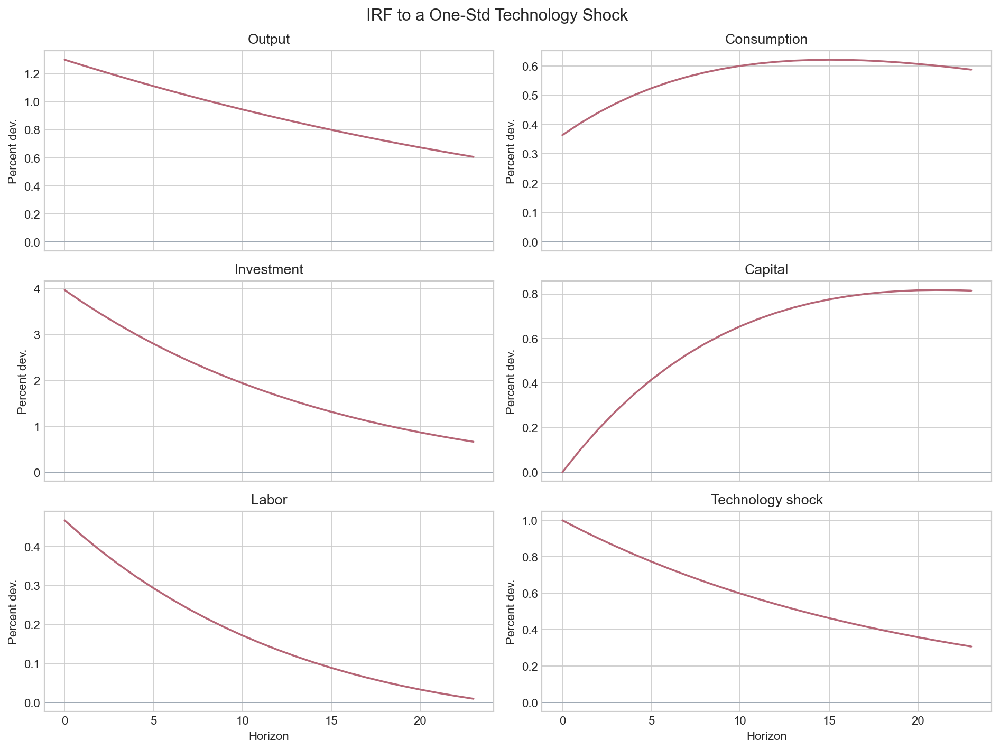
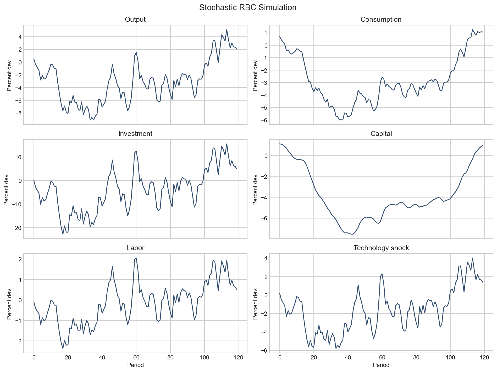

# pomdp-hank-policy

Исследовательский проект о построении экономической политики при неполной наблюдаемости и режимной неопределенности в макроэкономических моделях.  
Цель проекта: перейти от классического пайплайна к более гибкой постановке, в которой политика строится на основе belief state и в дальнейшем может быть реализована с использованием learning-based подходов.

## Логика проекта

1. **Baseline на простой модели**  
   Проверка вычислений на стандартной RBC-модели.

2. **Переход к новокейнсианской среде**  
   Добавление policy block и постановки задачи экономической политики.

3. **Скрытые состояния и неполная наблюдаемость**  
   Представление модели в форме пространства состояний и восстановление скрытых компонент.

4. **Режимная неопределенность**  
   Переход к средам со скрытыми режимами и структурными сдвигами.

5. **Learning-based policy design**  
   Сравнение классической схемы с более гибкими подходами к построению политики.

---

## Baseline на RBC-модели

На первом этапе реализована стандартная модель реального делового цикла (RBC) с технологическим шоком, описываемым процессом AR(1).

Цель этого этапа — создание воспроизводимого вычислительного baseline, на котором можно проверить:

- корректность задания модели
- вычисление стационарного состояния
- получение локального решения
- стохастическую симуляцию траекторий
- построение импульсных откликов
- базовые диагностические проверки

В текущей реализации:

- стационарное состояние вычисляется в замкнутой форме
- равновесные условия линеаризуются численно
- линейная система рациональных ожиданий решается методом обобщённого разложения Шура (generalized Schur / QZ decomposition)
- дополнительно проверяется выполнение условия Бланшара–Кана

### Что получено на этапе 1

В результате реализации baseline получены:

- стационарное состояние модели;
- матрицы линейной политики и перехода;
- стохастическая симуляция траекторий;
- импульсные отклики на положительный технологический шок;
- диагностические остатки и базовые sanity checks.

### Основные проверки

Для baseline были проведены следующие проверки:

- устойчивость линейного решения;
- выполнение условия Бланшара–Кана;
- корректность знаков импульсных откликов;
- малость остатков равновесных уравнений на стохастической симуляции;
- устойчивость результатов к смене `seed`.

---

## Визуализация baseline

### Импульсные отклики

После положительного технологического шока выпуск, потребление, инвестиции и труд увеличиваются на ударе, а капитал накапливается постепенно. Такая форма откликов соответствует стандартной экономической логике RBC-модели.

### Стохастическая симуляция

Симулированные траектории подтверждают устойчивость baseline-решения и согласуются с локальной аппроксимацией в окрестности стационарного состояния.

---

Результаты этапа сохраняются в `outputs/stage1/`:

- `steady_state.json` — параметры модели и стационарное состояние;
- `solution.json` — матрицы линейной политики и перехода;
- `simulated_paths.csv` — стохастическая симуляция;
- `irf.csv` — импульсные отклики;
- `diagnostics.csv` — диагностические остатки;
- `diagnostics_summary.json` — краткая сводка по проверкам;
- `stage1_report.md` — текстовый отчёт по этапу 1;
- `figures/` — графики.